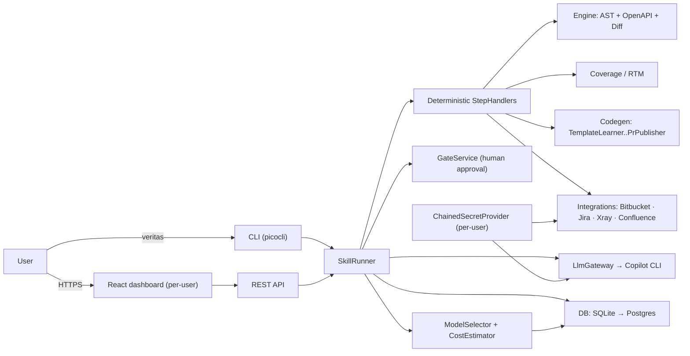
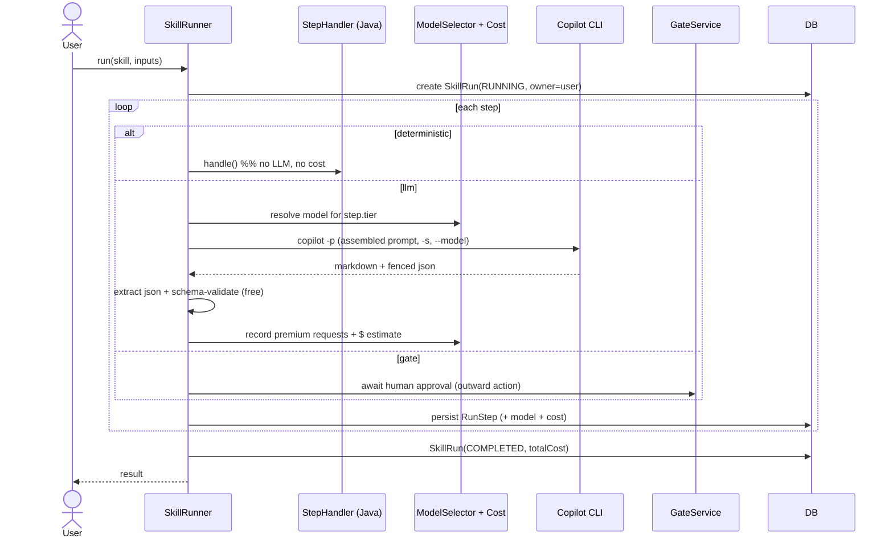
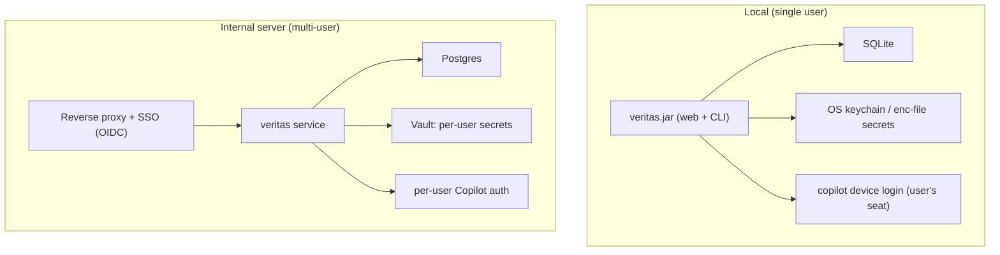
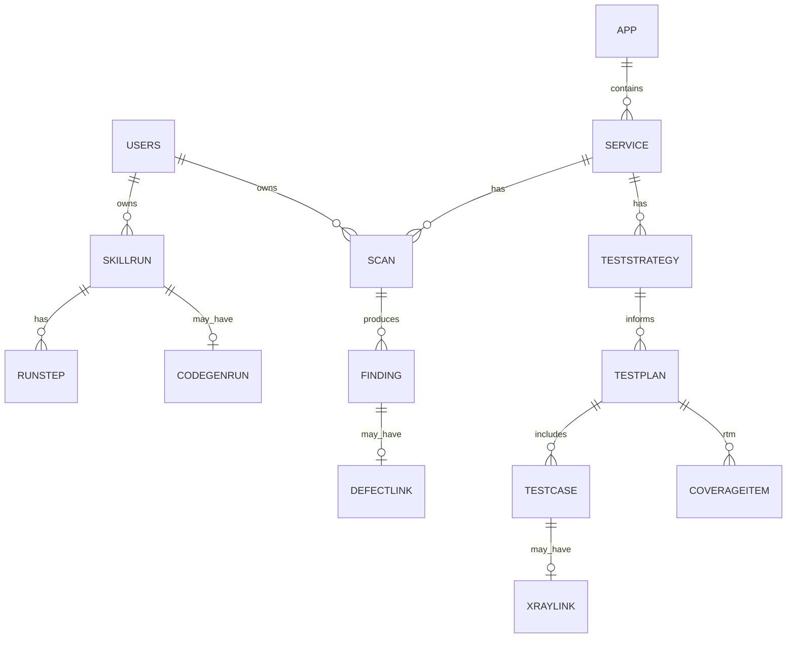

# Veritas — Architecture

Veritas is a **toolbox of independent, on-demand skills** that wrap the GitHub Copilot CLI. Three pillars
(validate the contract · manage the tests · generate automated tests). The LLM is called **only** for
reasoning/generation; everything deterministic (clone, AST, OpenAPI parse, diff, REST calls, file writing,
rendering, cost accounting) runs in Java. Local-first, server-ready.

See also: [cost-and-model-selection.md](cost-and-model-selection.md) ·
[security-auth-and-credentials.md](security-auth-and-credentials.md) ·
[review-test-cases.md](review-test-cases.md) ·
[test-generation-template.md](test-generation-template.md) ·
[prompts-review.md](prompts-review.md).

## 1. Component view

## 2. Skill run — where the LLM (and cost) actually happen

Every pipeline step is tagged `deterministic`, `llm`, or `gate`. Only `llm` steps cost money; the runner
resolves a model from the step's **tier** and records premium-requests/credits + dollar estimate per step.

## 3. Deployment — local-first, server-ready

The only three things that change between local and server are **storage**, **secrets**, and **auth**;
everything else is identical, isolated behind interfaces + Spring profiles.

## 4. Data model (high level)

Per-user ownership is present from the start so dashboards are scoped per user (see
[security-auth-and-credentials.md](security-auth-and-credentials.md)). Cost rolls up on `SkillRun`/`RunStep`.

## 5. Pillar flows

- **Validate contract (A):** discover repo (Bitbucket app-id) → clone → AST extract → OpenAPI parse →
  deterministic diff (L1–L4 + mechanical L6) → LLM reconcile (explain/fix/L5/L6 + corrected YAML) →
  report + corrected YAML. Detailed in the engine module.
- **Manage tests (B):** strategy / global+release plan with coverage reconciliation / create cases /
  **review cases** — the review flow is detailed in [review-test-cases.md](review-test-cases.md).
- **Generate tests (C):** template-driven — reads an MD template the user authors
  ([test-generation-template.md](test-generation-template.md)); learn template → generate → build-verify
  → gate → PR to the chosen output repo.
