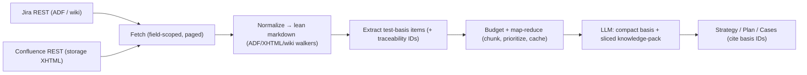

# Ingestion: parsing Jira & Confluence and feeding the LLM (token-optimized)

Jira (Cloud) returns **ADF** (Atlassian Document Format — nested rich-text JSON); Jira (Server/DC) returns
**wiki markup**; Confluence returns **storage-format XHTML** full of macros + layout. The REST payloads also
carry many irrelevant fields. Feeding any of this raw to the LLM is noisy and expensive. So a **deterministic
ingestion layer** sits between the APIs and the LLM, producing a compact, **citable** test-basis.

All steps 1–4 are **deterministic (no LLM)**; only the final synthesis (and an optional condense for oversize
inputs) calls the model. This is the "LLM only when needed" rule applied to ingestion.

## 1. Fetch lean, not whole (deterministic)

Never pull full payloads.

- **Jira:** `searchIssues(jql, fields, expand, startAt, maxResults)` with an explicit **fields allow-list**
  (configurable): `summary, description, issuetype, status, labels, components, fixVersions, priority,
  {acceptanceCriteriaField}, issuelinks, parent, subtasks`. Page through results. Description arrives as ADF
  (Cloud) or wiki (DC). Comments only when `includeComments=true` (off by default — high noise).
- **Confluence:** `getPage(pageId, expand=body.storage)` or by space/CQL; optional child pages to depth N
  (`maxDepth`, default 0). Pull only `body.storage` (or `body.view`).
- Cloud vs Server/DC differ (REST v3/ADF vs v2/wiki; Confluence Cloud `/wiki/rest` vs DC `/rest`) — behind
  the same edition flag used elsewhere.

## 2. Normalize → lean markdown (deterministic — the biggest raw-token win)

Pluggable `ContentNormalizer` implementations emit a common `NormalizedDoc{sourceType, sourceId, title,
markdown}`:

- **AdfToMarkdown** (Jira Cloud): walk the ADF tree — `doc → {paragraph, heading, bulletList, orderedList,
  table, codeBlock, panel, blockquote, rule}` and text `marks` (strong/em/code/link). Keep `mention`/`emoji`
  as text; **drop** `mediaSingle`/`media`/avatars/render hints. Bounded node set → a small, testable walker.
- **WikiToMarkdown** (Jira/Confluence Server-DC): headings `h1.`→`#`, `*bold*`, lists, `{code}`→fenced,
  `||th||`/`|td|`→md tables.
- **ConfluenceStorageToMarkdown** (jsoup): convert headings/lists/**tables**/code; **unwrap** useful macros
  (`ac:structured-macro` of type code/info/note/panel/expand → keep inner content; `jira` macro → keep the
  issue key); **drop** layout (`ac:layout*`), `toc`, images→alt-text-or-drop. Tables are preserved because
  requirements/rules frequently live in them.

Macros/layout/JSON/XML scaffolding are where most of the waste is — stripping them is the single largest
deterministic reduction before any model sees the text.

## 3. Extract the test-basis (keep signal, drop boilerplate)

`TestBasisExtractor` turns normalized docs into a compact list of `TestBasisItem{id, origin, kind, text}`:

- **kinds:** REQUIREMENT, ACCEPTANCE_CRITERIA, BUSINESS_RULE, CONSTRAINT, ENUM, EXAMPLE.
- **heuristics:** "Acceptance Criteria" sections and Gherkin Given/When/Then; bullet lists under requirement
  headings; sentences with must/shall/should; **table rows → one rule each**; enumerated values → ENUM.
- **traceability id:** `JIRA-123#desc`, `JIRA-123#ac`, `CONF-456#<heading-anchor>` — so the LLM can cite the
  exact source without us resending full text, and the output becomes a Requirements Traceability Matrix
  with **no orphans** (CTFL §1.4.4).
- Deduplicate near-identical items across linked issues/pages.

Optional: for unstructured prose with no detectable structure, an **economy-tier** "condense to requirements"
LLM step — only when heuristics yield too little, and cached.

## 4. Token optimization (the core)

1. **Field/section selection at fetch** — don't transfer what you won't use.
2. **ADF/XHTML/wiki → lean markdown** — removes JSON/XML/macro/layout noise.
3. **Extraction to a test-basis** — keep requirements/AC/rules, drop narrative/boilerplate.
4. **ID-based traceability** — outputs cite basis IDs instead of echoing text (shrinks input *and* output).
5. **Section-addressable knowledge-pack includes** — ~50% grounding-token cut (see
   [prompts-review.md](prompts-review.md)).
6. **Budget + map-reduce** — estimate tokens (`CostEstimator.estimateTokens`, ~4 chars/tok). If a basis
   exceeds `veritas.ingest.token-budget`, **chunk** by epic/component/page → condense each with an economy
   model → final synthesis with a deep model. **Prioritize** high-signal items (AC, rules) first; **log
   every dropped item** as a coverage blind-spot — never silent truncation.
7. **Caching** — `NormalizedDoc` + `TestBasis` keyed by content hash (Jira `updated` / Confluence `version`)
   skip re-fetch/re-parse; LLM condense reuses the `PromptCache` (model+prompt hash).
8. **Model tiering** — economy for parse/condense, deep only for final synthesis (see
   [cost-and-model-selection.md](cost-and-model-selection.md)).

The user always sees an **up-front estimate** ("ingested N issues + M pages → ~K basis items ≈ ~T tokens ≈
$X") before any spend, and the recorded actual after.

## 5. Feed to the LLM

Skills (`test-strategy`, `global`/`release-test-plan`, `create-test-cases`) receive the compact `TestBasis`
(an id→text table) plus only the relevant pack sections. The output cites basis IDs → RTM. The same
normalizers clean issue **descriptions** in the [review-test-cases](review-test-cases.md) flow and the
no-codebase path.

## 6. Module & client additions

`ca.bnc.qe.veritas.ingest`:
- `ContentNormalizer` (interface) + `AdfToMarkdown`, `WikiToMarkdown`, `ConfluenceStorageToMarkdown`.
- `NormalizedDoc`, `TestBasisItem`, `TestBasis`, `TestBasisExtractor`, `TestBasisAssembler` (merge code
  endpoints + Jira + Confluence, tag origins), `IngestBudgeter` (chunk/prioritize/estimate), `IngestCache`.

Integration methods (added to the clients in `integration/`):
- `JiraClient.searchIssues(jql, fields, expand, startAt, maxResults)`, `getIssue(key, fields)`.
- `ConfluenceClient.getPage(pageId, expand)`, `getPagesBySpace(spaceKey, ...)`, `getChildren(pageId, depth)`.
- Cloud + Server/DC variants behind the edition flag.

## 7. Risks / blind spots

- **Custom field for acceptance criteria varies per project** → configurable field id; if unmapped, fall back
  to description parsing and flag it.
- **Macros we don't recognize** → unwrap text content and log the macro name (never drop silently).
- **Huge spaces / deep child trees** → `maxDepth` + budget + logged drops.
- **Attachments/images/diagrams** → can't feed; recorded as a blind-spot so coverage isn't overstated.
- **ADF/storage schema drift** → walkers are tolerant (unknown node → recurse children / keep text), with a
  unit-test corpus of real samples.
