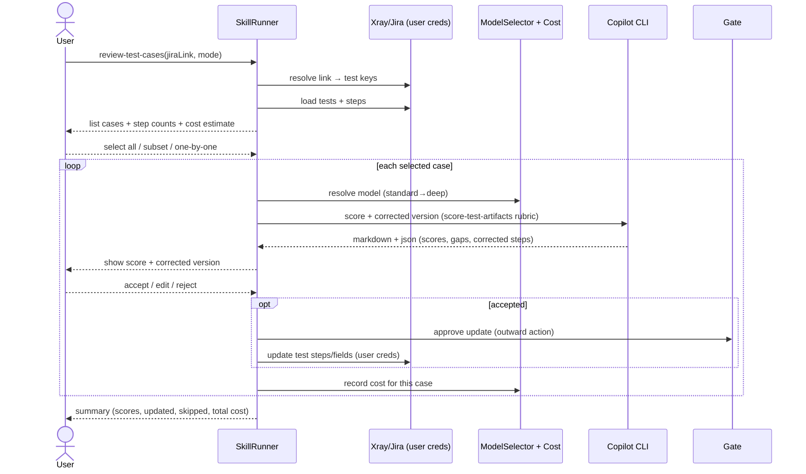

# Review test cases (ISTQB Test Analyst)

Interactive skill: paste a **Jira link**, Veritas loads every test case behind it, shows how many steps
each has, lets you review **all or one-by-one**, the LLM scores each case against the ISTQB Test Analyst
rubric and proposes a **corrected version**, and on your acceptance it **updates the test case directly in
Jira/Xray using your own credentials** — gated and audited.

## Flow



## Inputs

- `jiraLink` — a Jira filter/JQL, Xray **Test Plan**/**Test Set**, board, or a single issue. Resolved to a
  set of test keys deterministically.
- `mode` — `all` | `select` (subset) | `one-by-one`. The CLI exposes `--select <keys>` / `--dry-run`
  (list + cost only); the dashboard offers checkboxes.
- model tier (default standard; promote to deep if scores look unstable).

## Steps (D = deterministic, L = llm, G = gate)

1. **resolveLink (D)** — parse link → JQL/keys (`JiraClient.searchIssues` / Xray resolution).
2. **loadTests (D)** — fetch tests + steps; compute **step counts**; show a **cost pre-estimate** (cases ×
   tier rate) before any spend.
3. **select (UI)** — user picks all / subset / one-by-one.
4. **review (L)** per case — reuse `score-test-artifacts` (Test Analyst rubric C1–C6) → scores + gaps +
   **corrected steps**. Optional **L1 light self-check** (cheap) that the corrected steps still cover the
   original intent.
5. **present (UI)** — show score + corrected version (diff vs original).
6. **gate (G)** + **updateInJira (D)** — on accept, update the test in Xray/Jira with the **user's** token;
   idempotent (skip if unchanged); audited (who/what/when).
7. **persist (D)** — `ReviewResult` per case + cost; run summary.

## LLM output shape (validated)

```json
{
  "testKey": "PROJ-123",
  "scores": { "C1_clarity": 4, "C2_technique": 3, "C3_coverage": 4,
              "C4_data": 3, "C5_oracle": 5, "C6_maintainability": 4 },
  "score_100": 78,
  "verdict": "Solid",
  "gaps": [ { "severity": "MAJOR", "dimension": "C2_technique",
              "issue": "No boundary cases for amount", "cite": "CTAL-TA §3.x" } ],
  "correctedSteps": [ { "action": "...", "data": "...", "expected": "..." } ],
  "rationale": "short"
}
```

## Integration methods needed (new — both Cloud & DC)

- `XrayClient.getTests(jql|planKey|setKey)` and `getTestSteps(testKey)` — load + step counts.
  Cloud = GraphQL `getTests { results { jira{key} steps{ action data result } } }`; DC = REST
  `/rest/raven/2.0/api/test/{key}/step`.
- `XrayClient.updateTestSteps(testKey, steps)` — apply the accepted correction. Cloud = GraphQL
  `updateTestStep`/`addTestStep`/`removeTestStep`; DC = REST step update. Behind the `GitHost`-style
  edition flag.

## Credentials & cost

- Updates use the **invoking user's** Jira/Xray token from the per-user secret store
  ([security-auth-and-credentials.md](security-auth-and-credentials.md)) — never logged, never in the DB,
  gated, audited, pre-flight scope-checked.
- Cost is estimated **before** running (step counts drive prompt size → token/credit estimate) and recorded
  **per case** so the user sees "reviewing N cases ≈ X requests ≈ $Y" up front and the actual after. See
  [cost-and-model-selection.md](cost-and-model-selection.md).
