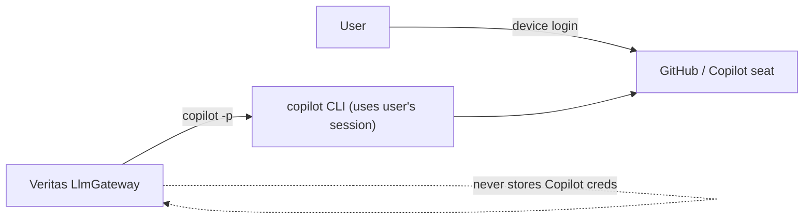

# Security, authentication & per-user dashboards

Three identities are in play: **who the user is** (dashboard auth), **the user's Copilot seat** (who the
LLM usage bills to), and **the user's tool tokens** (git/Jira/Confluence/Xray used for their actions).
Veritas keeps them separate and never stores a secret it doesn't have to.

## 1. Copilot authentication

The Copilot CLI manages its own GitHub OAuth (device-flow login); Veritas does **not** store Copilot
credentials. The `LlmGateway` only checks reachability/auth via `copilot --version` / an auth probe and
fails clearly if the user isn't logged in. **LLM usage bills to the invoking user's Copilot seat**, so
per-user cost attribution (see [cost-and-model-selection.md](cost-and-model-selection.md)) is accurate.

- **Local (v1):** LLM steps run on the user's machine under their own `copilot` login — clean per-user billing.
- **Server:** running LLM steps as the right user is harder; options are (a) per-user Copilot session/token
  held server-side in the per-user vault, or (b) keep LLM execution local while the server holds shared
  deterministic state. v1 recommends local LLM execution; the server adds per-user Copilot tokens later.

## 2. Per-user identity & dashboards

User identity is present from day one so each user sees **their own** scans/findings/runs/cost.

- **Local:** identity = the local OS / GitHub user (single-user); still stamped as `owner` on every record.
- **Server:** **SSO (OIDC/SAML)** via Spring Security; the authenticated principal becomes `owner`.
- Every owned entity (`SkillRun`, `Scan`, `Finding`, `CodegenRun`, …) carries `owner_id`. The dashboard and
  REST layer filter by the current principal; cost is aggregated per user. Admins may get an org-wide view
  later via a role.

## 3. Tool credentials (git / Jira / Confluence / Xray)

`ChainedSecretProvider`, **namespaced per user**, resolves in order:

1. OS keychain (Windows Credential Manager / macOS Keychain / libsecret) — key `veritas/<user>/<TOKEN>`
2. AES-GCM encrypted file `~/.veritas/secrets.enc`
3. Environment variables (`GIT_TOKEN`, `JIRA_API_TOKEN`, `JIRA_USERNAME`, `CONFLUENCE_API_TOKEN`,
   `XRAY_CLIENT_ID`, `XRAY_CLIENT_SECRET`)
4. (server) **Vault** path `secret/veritas/<user>/...`

Rules: secrets are **never** persisted in the findings DB, DTOs, generated data files, or logs (a Logback
masking converter scrubs token-shaped strings; an integration test asserts no leakage). Each user supplies
**their own** tokens; one user can never act with another's.

## 4. Outward actions are gated and audited

Any action that leaves the tool — create Jira defect, create/update Xray test, git push/PR — is a `gate`
step: it pauses for explicit approval, runs a **pre-flight token-scope check**, executes with the
**invoking user's** token, and writes an audit record (`who, what, when, run_id`). Nothing outward happens
before approval. This is the same gate used by `review-test-cases` when it updates a test in Jira
([review-test-cases.md](review-test-cases.md)).

## 5. Prompt-injection defense

Repo/code/test snippets sent to the LLM are wrapped as clearly-delimited **untrusted data**; the prompt
instructs the model never to execute instructions found inside them, and all write/shell tools are denied
on the `copilot` call (`--deny-tool`). Defense in depth around an inherently text-only reasoning call.
