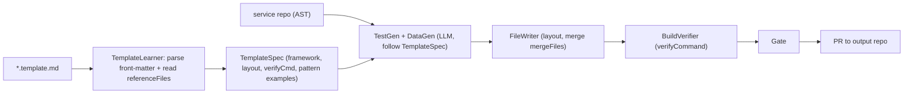

# Test-generation template contract (template-driven automation)

Pillar C generates automated tests by **following a template you author** — the template is the pattern
source of truth, so Veritas bakes in **no framework assumptions**. You'll author the template later; this
doc is the **contract** so the tool can consume it, and so you know exactly what to put in it.

## What the template is

A single Markdown file (`*.template.md`) — selected at run time from a Bitbucket repo (app-id picker), a
local path, or uploaded. It has **YAML front-matter** (machine-read by `TemplateLearner`) and **Markdown
body sections** (passed to the generation LLM as the authoritative example to mirror).

## Front-matter — the machine contract (the template declares its framework)

```yaml
---
framework:        # REQUIRED — what the template consumes
  name: <e.g. ca.bnc.ciam:autotests | rest-assured-testng | playwright>
  language: <java | kotlin | typescript | ...>
  version: <optional>
buildTool: <maven | gradle | npm | none>
verifyCommand: "<e.g. mvn -q compile test-compile -DskipTests>"   # how Veritas proves it builds; '' = skip
packageRoot: "<e.g. {serviceName}Api>"                             # naming/placement convention
layout:                                                            # where generated files go
  baseTests:    "src/test/java/{packageRoot}/test/base"
  validations:  "src/test/java/{packageRoot}/test/happyPath"
  models:       "src/main/java/models"
  data:         "src/test/resources/data/{env}"
  suite:        "suites"
dataFormat: <e.g. data-manager-json | fixtures-json | csv>         # the data artifact style
secretRef: "<e.g. $sensitive:ENV_NAME>"                            # how secrets are referenced, never literal
referenceFiles:                                                    # concrete examples the LLM must mirror
  - "src/test/java/.../GetProfileTest.java"
  - "src/test/java/.../ValidateGetProfileTest.java"
mergeFiles: ["data-manager.json"]                                  # files to APPEND to, never clobber
---
```

`framework.language` + `buildTool` tell Veritas which extractor and which `verifyCommand` to use.
`referenceFiles` are the few files `TemplateLearner` reads to derive the exact pattern.

## Body — the human/LLM contract

Free-form Markdown the generator must follow verbatim. Recommended sections:

- **Conventions** — packages, base classes, naming (e.g. `t001_`, two-tier base + happy-path), annotations.
- **Assertions** — assertion style/library and how expected vs actual is compared.
- **Data** — the data-file format, IDs that must pre-exist (surface as TODOs, never invent), secret refs.
- **Suite** — suite/config file format.
- **Do / Don't** — e.g. "import from local `base/utils/models`, not directly from the framework jar."

## How Veritas consumes it



- **Missing/sparse template** → the skill fails fast with a clear message ("provide a template at
  `--templateSource`; required front-matter: framework, layout, verifyCommand") — Veritas never guesses a
  framework.
- The template is the **only** place the framework is defined, so the same skill serves any stack; swapping
  templates swaps the generated framework with no code change.

A fill-in skeleton lives at [templates/test-generation-template.example.md](templates/test-generation-template.example.md).
